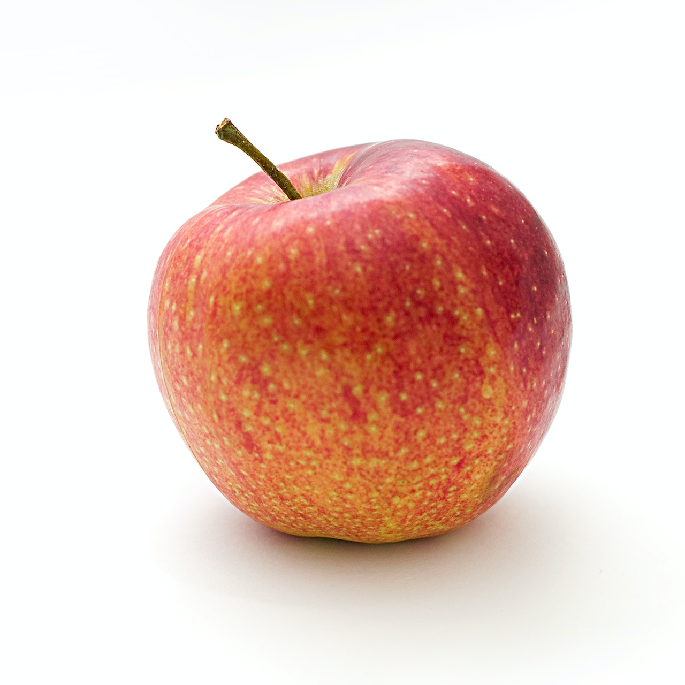

<h1>DJL Segment Anything Model (SAM)</h1>

- [Introduction](#introduction)
- [Project Structure](#project-structure)
- [Installation \& Usage](#installation--usage)
- [Implement your Own PyTorch Model](#implement-your-own-pytorch-model)
  - [Add the Dependencies](#add-the-dependencies)
  - [Implement the Model](#implement-the-model)
  - [Translator](#translator)
  - [Criteria, Model, and Predictor](#criteria-model-and-predictor)
  - [Tips](#tips)
- [Resources](#resources)

## Introduction

This repository is a Maven project that wraps the [Segment Anything Model](https://github.com/facebookresearch/segment-anything). You can read more about the converting process under the [`/pytorch_convert/README.md`](/pytorch_convert/README.md) directory.

To interface with the TorchScript model, we used the [DJL](https://djl.ai/) framework. DJL is a deep learning framework for Java that supports PyTorch, TensorFlow, and MXNet. It also provides a Java API to load and run TorchScript models.

<div style="display: flex; justify-content: center; gap: 1rem">
    
    
</div>

## Project Structure

The project is structured as follows:

- [`/pytorch_convert`](/pytorch_convert): Python code to patch and save the Segment Anything Model (SAM) as TorchScript to a new file.
- [`/src/main/java/djlsam/Sam.java`](/src/main/java/djlsam/Sam.java): Java code to load the TorchScript model and run inference.
- [`/src/main/java/djlsam/translators`](/src/main/java/djlsam/translators): Java classes to convert the input/output tensors to/from the TorchScript model.
- [`/src/main/test/djlsam/SamTest.java`](/src/main/test/djlsam/SamTest.java): Java code to test the model.
- [`/src/resources/images`](/src/resources/images): Test images.
- [`/src/resources/pytorch_models`](/src/resources/pytorch_models): TorchScript models.

## Installation & Usage

It is recommended to use an IDE such as IntelliJ IDEA to run the project.

To install the dependencies, run the following command:

```bash
mvn clean install
```

To run the tests, run the following command:

```bash
mvn test
```

## Implement your Own PyTorch Model

Before implementing a model with the `DJL` framework, you should first [convert your model to TorchScript](/pytorch_convert/README.md#convert-the-model-to-torchscript).

You can also find example from the `DJL` documentation [here](http://docs.djl.ai/examples/index.html).

### Add the Dependencies

Add the following dependencies to your `pom.xml` file:

```xml
<dependency>
    <groupId>ai.djl</groupId>
    <artifactId>api</artifactId>
    <version>0.21.0</version>
</dependency>
<dependency>
    <groupId>ai.djl.pytorch</groupId>
    <artifactId>pytorch-engine</artifactId>
    <version>0.22.0</version>
    <scope>runtime</scope>
</dependency>
```

> **Note:** You can find the latest version of the dependencies [here](https://mvnrepository.com).

### Implement the Model

Create a new class for your model. Within the class you can load the TorchScript model and run inference. You can find an example [here](/src/main/java/djlsam/Sam.java).

The main idea is to create the following objects:

```java
Translator<Image, SamRawOutput> translator;
Criteria<Image, SamRawOutput> criteria;
ZooModel<Image, SamRawOutput> model;
Predictor<Image, SamRawOutput> predictor;
```

Each object has an input and output type which should match the input and output types of the `translator` object.

DJL has many input/output types as well as translators already implemented. You can find them [here](https://javadoc.io/doc/ai.djl/api/latest/index.html).

### Translator

The `translator` object is used to convert the input/output tensors to/from the TorchScript model. You can find an example [here](/src/main/java/djlsam/translators/SamTranslator.java).

It overrides the following methods:

- `processInput(TranslatorContext ctx, Image input)` to convert the input image to a `NDList` object.
- `processOutput(TranslatorContext ctx, NDList list)` to convert the output `NDList` object to a `SamRawOutput` object.

The `SamRawOutput` object is a custom class wrapper that contains the output tensors of the model. You can find an example [here](/src/main/java/djlsam/SamRawOutput.java).

### Criteria, Model, and Predictor

The `criteria` object is used to specify the input and output types of the model. You can find an example [here](/src/main/java/djlsam/Sam.java#L35).

> **Note:** The path of the TorchScript model must be a directory that contains the `.pt` file and it must have the same name as the directory.

By calling the method `criteria.loadModel();`, the `model` object is created. You can find an example [here](/src/main/java/djlsam/Sam.java#L45).

Finally, the `predictor` object is created by calling the method `model.newPredictor();`. You can find an example [here](/src/main/java/djlsam/Sam.java#L49).

### Tips

- You can use the `NDManager` object to create `NDArray` objects.

## Resources

- [Segment Anything Model](https://github.com/facebookresearch/segment-anything)
- [DJL](https://djl.ai/)
